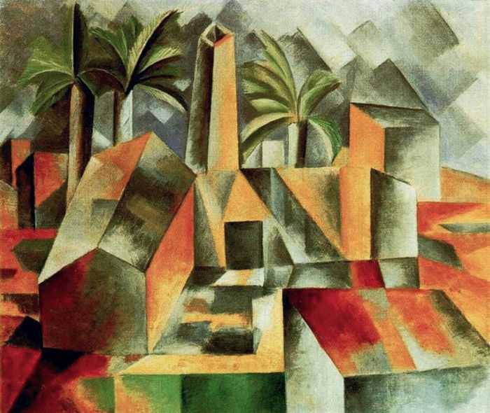
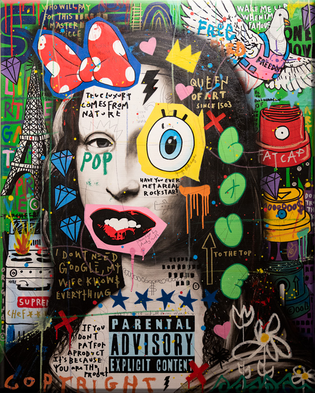
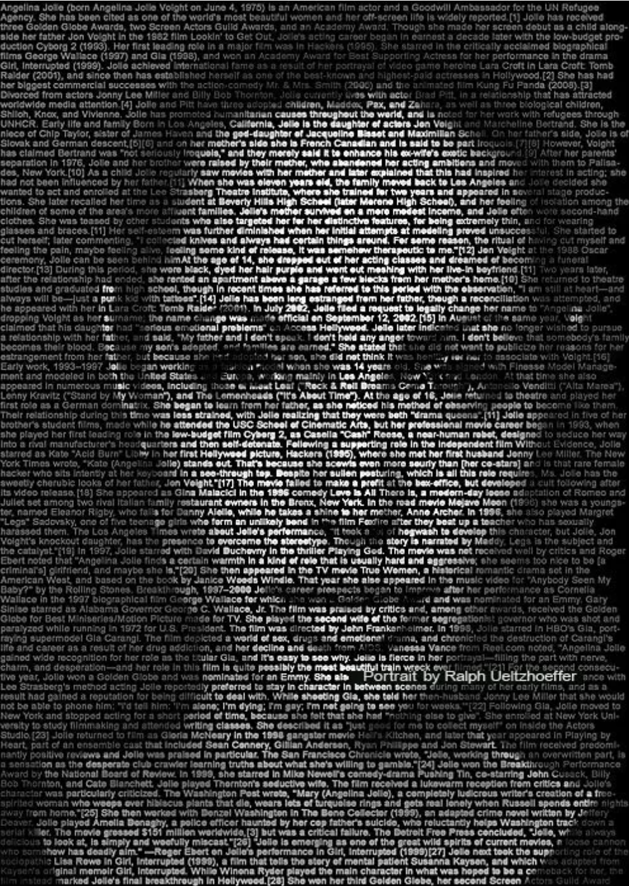

#aaga0750_9103_tut4

## Quiz 8
### Part 1: Inspiration for Imaging Technique
**Chosen Technique:** Cubism-inspired grid arrangement
Inspired by cubism’s or collage's exploration of fragmented perspectives, I aim to cut a painting into a grid and rearrange the sections to create an abstract yet cohesive composition. This will be achieved by replacing some grid parts with text while adding monochrome and dynamic lighting effects. This technique is chosen as the design blends the past with the future. Furthermore, this technique not only embraces the cubist style but also allows for creative flexibility in engaging the viewer. The grid approach encourages a balance between structure and abstraction, meeting the assignment’s requirement for a visually striking piece.

**_Inspirational Images_**
1. 'Factory, Horta de Ebbo', 1909 (oil on canvas) by Pablo Picasso

2. Modern Mona Lisa Collage, n.d

3. Ralph Ueltzhoeffer’s Angelina Jolie Portrait, 2008

### Part 2: Coding Technique Exploration
**Chosen Technique:** CSS Grid and JavaScript for Image/Content Replacement To implement this cubism-inspired grid technique, I’ll use CSS Grid to create a flexible layout for rearranging images. JavaScript will dynamically swap out images with text or adjust color schemes (monochrome) and lighting effects. Specifically using functions like get() to resize. p5 js library will be used for the ASICII art effect. This approach will give me control over each grid section, allowing real-time interactions and unique modifications.

**_Links to example code_**

[Cubist art](https://github.com/williamngan/kubist)

[Typographic art](https://editor.p5js.org/pattvira/sketches/aT8iNvJV1)

[Collage art](https://github.com/jnfsmile/p5-collage/blob/master/sketch.js)

[Coloured shapes](https://p5js.org/examples/shapes-and-color-color/)

[Collage Demonstration](https://www.youtube.com/watch?v=-YS5t1R-GO8)

### References
Actress – TEXT portrait. (n.d.). TEXT PORTRAIT. https://ueltzhoeffer2textportrait.wordpress.com/category/actress/

(n.d.). ASCII Art Archive. https://www.asciiart.eu/

CT105_ASCII Art_image by pattvira -p5.js web editor. (n.d.). p5.js Web Editor. https://editor.p5js.org/pattvira/sketches/aT8iNvJV1

Cubism. (n.d.). Free art lessons, design lessons, and art appreciation for all. https://www.artyfactory.com/art_appreciation/art_movements/cubism.htm

P5-collage/sketch.js at master · jnfsmile/p5-collage. (n.d.). GitHub. https://github.com/jnfsmile/p5-collage/blob/master/sketch.js

P5-collage/sketch.js at master · jnfsmile/p5-collage. (n.d.). GitHub. https://github.com/jnfsmile/p5-collage/blob/master/sketch.js

Tate. (n.d.). Cubism. https://www.tate.org.uk/art/art-terms/c/cubism#:~:text=Cubism%20opened%20up%20almost%20infinite,including%20constructivism%20and%20neo%2Dplasticism

What is a collage in art? (n.d.). EDEN Gallery. https://www.eden-gallery.com/news/collage-in-art

Williamngan/kubist: A little webapp to create cubism-like svg. (n.d.). GitHub. https://github.com/williamngan/kubist

(n.d.). YouTube. https://www.youtube.com/watch?v=-YS5t1R-GO8

